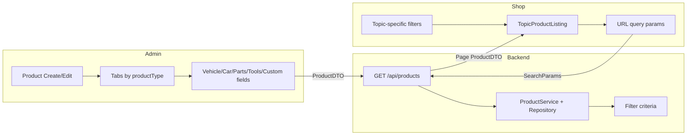

# Filter Attributes System — Implementation Plan

## Step 0: Inventory Summary (Done)

| Area                   | Current state                                                                                                                                                                                                                                                                                                                                                                                                                                                                                                                            |
| ---------------------- | ---------------------------------------------------------------------------------------------------------------------------------------------------------------------------------------------------------------------------------------------------------------------------------------------------------------------------------------------------------------------------------------------------------------------------------------------------------------------------------------------------------------------------------------- |
| **Product entity**     | [Product.java](backend/src/main/java/com/ecommerse/backend/entities/Product.java): name, description, price, stockQuantity, sku, brand, category (ManyToOne), infoSections 1–10, quoteOnly; no productType, condition, or type-specific fields.                                                                                                                                                                                                                                                                                          |
| **Category taxonomy**  | [Category.java](backend/src/main/java/com/ecommerse/backend/entities/Category.java): tree (parent/children); roots from [database_migration_shop_topics.sql](database_migration_shop_topics.sql): cars, parts, tools, custom. Product type is implied by category root (no `product_type` column).                                                                                                                                                                                                                                       |
| **Admin product form** | [app/admin/products/new/page.tsx](app/admin/products/new/page.tsx), [app/admin/products/[id]/page.tsx](app/admin/products/[id]/page.tsx): single form with basics (name, price, sku, category, brand, quoteOnly, info sections, variants, images). Category loaded by topic ([getCategoriesByTopic](lib/adminApi.ts)); no tabs, no condition/vehicle/car/parts/tools/custom fields.                                                                                                                                                      |
| **Shop listing & API** | [TopicProductListing](components/topic-product-listing.tsx) calls [fetchProducts](lib/shopApi.ts) with SearchParams (query, category, rootCategoryId, page, limit, minPrice, maxPrice, brand, availability, sortBy). [ProductController](backend/src/main/java/com/ecommerse/backend/controllers/ProductController.java) GET `/api/products`: page, size, sortBy, sortDir, category, rootCategoryId, search, minPrice, maxPrice, brand, inStockOnly. No URL sync for filters; no condition or type-specific filters.                     |
| **Filtering layer**    | [ProductService](backend/src/main/java/com/ecommerse/backend/services/ProductService.java): getCatalogProducts, advancedSearch, getProductsByRootCategory, advancedSearchByRootCategory use [ProductRepository](backend/src/main/java/com/ecommerse/backend/repositories/ProductRepository.java) JPQL (findActiveForCatalog, findWithFilters, findByCategoryIdsAndSearch, findWithFiltersAndRootScope). All filter logic server-side; TopicProductListing does extra client-side filter when using fetch with limit 200 for brand/price. |
| **Shop routing**       | [app/shop/[slug]/page.tsx](app/shop/[slug]/page.tsx): slug = topic → TopicPage; else ProductDetailPage. [app/shop/[slug]/[subSlug]/page.tsx](app/shop/[slug]/[subSlug]/page.tsx): topic subcategory page using TopicProductListing with defaultCategoryId. No query-param handling for filters.                                                                                                                                                                                                                                          |
| **DB migrations**      | Plain SQL files (e.g. database_migration_shop_topics.sql); no Prisma. Run manually or via [run-migration.js](run-migration.js).                                                                                                                                                                                                                                                                                                                                                                                                          |

---

## A) Data model changes (DB + types)

### 1. Product type and common attributes

- **Derive productType from category**: Keep using root category (cars/parts/tools/custom) as source of truth. Add optional denormalized column `product_type` (VARCHAR, e.g. `car`, `part`, `tool`, `custom`) for indexing and admin display; backfill from category root; keep in sync on category change.
- **New columns on `products**` (all nullable for backwards compatibility):
  - `condition` VARCHAR(20) — enum: new, used, refurbished
  - `oem_type` VARCHAR(20) — enum: oem, aftermarket (optional)
  - `product_type` VARCHAR(20) — car, part, tool, custom (optional, denormalized from category)

Existing: `brand`, `price`, `stock_quantity` (inStock derived). No new table for “common” fields.

### 2. Vehicle compatibility (parts/custom; optional tools)

- **Option A (recommended)**: New table `product_vehicle_compatibility`:
  - `product_id` (FK), `compatibility_mode` (universal | vehicle_specific), `compatible_make`, `compatible_model`, `year_start`, `year_end`, `vin_compatible` (boolean). One row per product; for vehicle_specific, multiple make/model/year ranges can be represented by multiple rows or a single row with arrays (see below).
- **Option B**: Columns on `products`: `compatibility_mode` VARCHAR(20), `compatible_makes` TEXT[] (or JSONB), `compatible_models` TEXT[], `compatible_year_start` INT, `compatible_year_end` INT, `vin_compatible` BOOLEAN. Single row per product; arrays for multi make/model.

Use **Option B** (columns + arrays) to avoid join and keep filtering in single table; PostgreSQL supports `ANY(compatible_makes) = ?` and year range in one query.

### 3. Cars-only attributes (columns on `products`)

Add: `make`, `model`, `year` (int), `mileage` (int), `fuel_type`, `transmission`, `body_type`, `drive_type`, `power_kw` (int), `color` (VARCHAR), `warranty_included` (boolean). All nullable.

### 4. Parts-only attributes

Add: `part_category` VARCHAR, `part_number` VARCHAR (or reuse `sku` for display; keep both if part_number is OEM number), `position` VARCHAR(50) or TEXT[] for multi (e.g. front, rear, left, right), `material` VARCHAR, `reconditioned` BOOLEAN.

### 5. Tools-only attributes

Add: `tool_category` VARCHAR, `power_source` VARCHAR, `voltage` INT, `torque_min_nm` INT, `torque_max_nm` INT, `drive_size` VARCHAR, `professional_grade` BOOLEAN, `is_kit` BOOLEAN.

### 6. Custom-only attributes

Add: `custom_category` VARCHAR, `style_tags` TEXT[] (e.g. sport, luxury, off_road, classic), `finish` VARCHAR, `street_legal` BOOLEAN, `installation_difficulty` VARCHAR.

### 7. Indexes

- Add indexes on: `product_type`, `condition`, `(root category via category_id + category.parent chain)` — or `product_type` if denormalized; `price`; `brand`; cars: `make`, `model`, `year`; compatibility: `compatibility_mode`, `compatible_year_start`, `compatible_year_end`; and any other frequently filtered columns. Prefer composite (e.g. (product_type, make, year)) for topic-scoped listing.

### 8. Java and TypeScript types

- **Backend**: Add enums (e.g. `ProductCondition`, `OemType`, `CompatibilityMode`, `FuelType`, `Transmission`, etc.) in a shared package; extend [Product.java](backend/src/main/java/com/ecommerse/backend/entities/Product.java) with new fields; extend [ProductDTO.java](backend/src/main/java/com/ecommerse/backend/dto/ProductDTO.java) for API and admin. For arrays (compatible_makes, style_tags, position): use `List<String>` in entity with `@ElementCollection` or `@Convert` (e.g. JSON/PostgreSQL array).
- **Frontend**: Shared constants/enums in `lib/filterAttributes.ts` (or under `lib/`) for admin and shop; extend [Product](lib/shopApi.ts) and [ProductCreateInput](lib/adminApi.ts) (and admin product type) with optional filter fields.

### 9. Migration file

- Single SQL migration (e.g. `database_migration_filter_attributes.sql`): `ALTER TABLE products ADD COLUMN ...` for each new column (nullable, no default except where specified); add indexes; backfill `product_type` from category root where possible. No data loss; existing products remain valid.

---

## B) Admin UI (product create/edit)

- **Tab 1 — Basics**: productType (read-only from selected category’s root), category, brand, price, condition (new/used/refurbished), inStock (from stock quantity), oemType (optional). Reuse existing category dropdown; productType derived from category (resolve root by parent chain or API that returns root slug).
- **Tab 2 — Vehicle compatibility**: Shown when productType is part, custom, or tool (optional for tool). compatibilityMode (Universal / Vehicle-specific). If Vehicle-specific: make(s), model(s), year start/end, vinCompatible. Validation: if vehicle_specific then at least one make, one model, and year range; block “Publish”/active save if invalid; allow draft save.
- **Tab 3 — Car fields**: Shown only when productType = car. make, model, year, mileage, fuelType, transmission, bodyType, driveType, powerKw, color, warrantyIncluded. Validation: make, model, year, price, condition required for publish.
- **Tab 4 — Parts**: Shown only when productType = part. partCategory, partNumber, position (multi-select), material, reconditioned.
- **Tab 5 — Tools**: Shown only when productType = tool. toolCategory, powerSource, voltage, torque min/max, driveSize, professionalGrade, isKit.
- **Tab 6 — Custom**: Shown only when productType = custom. customCategory, styleTags (multi), finish, streetLegal, installationDifficulty.

Implementation notes:

- Use existing [Tabs](app/admin/products/new/page.tsx) and form state; add conditional rendering by `productType` (derived from selected category: e.g. fetch root for selected category or map category id to topic via existing getCategoriesByTopic / category tree).
- Reuse existing submit flow: build payload matching extended ProductDTO / ProductCreateInput and call existing create/update APIs.
- Enums and options: single source of truth from shared constants (e.g. `lib/filterAttributes.ts`) used by both admin and shop.
- Make/model lists: admin seed list (static list in constants) or dedicated API (e.g. GET /api/makes, GET /api/models?make=) if you add such later; for MVP, static list or free-text with validation.

---

## C) Shop filter UI + query logic

### 1. Global filters (all topics)

- Price range (min/max), Brand, Availability (in stock), Condition (new/used/refurbished). Already have price, brand, inStock in API; add condition to API and UI.

### 2. Topic-specific filters

- **Cars**: make, model, year range, mileage range, fuelType, transmission, bodyType, driveType, power range, warrantyIncluded.
- **Parts**: Vehicle selector (My Car: make → model → year); brand, oemType, partCategory, partNumber (search), position, condition.
- **Tools**: toolCategory, brand, powerSource, voltage range, torque range, driveSize, professionalGrade, isKit, condition.
- **Custom**: Vehicle selector (make/model/year); styleTags, finish, streetLegal, installationDifficulty, brand, condition.

No location, shipping speed, or ratings anywhere.

### 3. URL query params

- Serialize all active filters into query params (e.g. `brand=Bosch&priceMin=50&priceMax=200&inStock=1&make=BMW&model=3-series&yearMin=2016&yearMax=2020`). Use Next.js `useSearchParams` and `useRouter` in [TopicProductListing](components/topic-product-listing.tsx) (and subcategory page if it uses the same component): on mount, parse params and set filter state; on filter change, update URL (replace or push). Ensure deep links and back/forward work.

### 4. Backend filtering

- Extend GET `/api/products` (and underlying [ProductService](backend/src/main/java/com/ecommerse/backend/services/ProductService.java) / [ProductRepository](backend/src/main/java/com/ecommerse/backend/repositories/ProductRepository.java)) to accept additional query params: condition, (for cars) make, model, yearMin, yearMax, mileageMin, mileageMax, fuelType, transmission, bodyType, driveType, powerMin, powerMax, warrantyIncluded; (for parts) compatibilityMode, compatibleMake, compatibleModel, compatibleYear, oemType, partCategory, position; (for tools) toolCategory, powerSource, voltageMin/Max, torqueMin/Max, driveSize, professionalGrade, isKit; (for custom) styleTags, finish, streetLegal, installationDifficulty.
- Implement via:
  - **Preferred**: One flexible method (e.g. `findWithFilterAttributes(categoryIds, FilterCriteria criteria, Pageable)`) using JPA Criteria or a single JPQL with conditional clauses so all filters are applied in DB (server-side). Ensure compatibility match: (compatibleYear between yearStart and yearEnd) AND make IN compatible_makes AND model IN compatible_models when vehicle selector is used.
  - Avoid N+1: entity graph for images/variants already in place; no extra joins unless needed for facet counts.
- Pagination and sort: keep existing (page, size, sortBy, sortDir). Default sort remains e.g. createdDate desc.

### 5. Facet counts (optional)

- If time allows: endpoint or same GET with `facets=true` returning counts per brand, make, condition, etc., for current filter context. Otherwise defer.

### 6. TopicProductListing changes

- [components/topic-product-listing.tsx](components/topic-product-listing.tsx): Accept `topicSlug` (or topic) to show topic-specific filter controls. Sync filter state to URL (useSearchParams + router.replace). Parse URL on load and set initial state. Remove client-side filtering for brand/price when backend supports all filters; call fetchProducts with full param set from URL/state so filtering is server-side only and pagination is correct.

---

## D) Migration and backfill

- **Migration**: All new columns nullable. Set defaults only where safe: e.g. `compatibility_mode` default `universal` for existing products (optional); `in_stock` derived from `stock_quantity > 0` (no new column). Backfill `product_type` from category root (UPDATE products SET product_type = … FROM categories … WHERE category root slug = 'cars'/'parts'/'tools'/'custom').
- **Admin “missing attributes” report**: New admin page or section (e.g. `/admin/products/missing-attributes`) that lists products missing required attributes per type (e.g. Cars: missing make/model/year; Parts vehicle_specific: missing make/model/year range). Do not block existing published products; enforce strict validation only for new products or when editing and saving as active (draft save allowed with missing required fields).

---

## E) Tests and acceptance criteria

- **Unit**: Filter param parsing/serialization (URL ↔ filter state) on frontend; backend filter criteria builder or query building for new params.
- **Backend**: Repository or service tests for filter correctness — e.g. compatibility year range (selected year between year_start and year_end), make/model match; combined filters (price + brand + condition).
- **Admin**: Validation tests for vehicle-specific (make, model, year required when compatibilityMode = vehicle_specific); draft vs active save behavior.
- **Regression**: Existing products (with null new fields) still list and can be purchased; GET /api/products without new params returns same behavior as today.
- **Acceptance**: Admin can create/edit each product type and sees only relevant tabs; vehicle-specific parts/custom cannot be published without make+model+year; shop filters per category persist in URL and return correct results; no location/shipping/rating filters.

---

## Implementation order (recommended)

1. **Shared enums/constants** — Java enums + TypeScript constants (lib/filterAttributes.ts or similar) for condition, oemType, compatibilityMode, fuelType, transmission, bodyType, driveType, position, powerSource, driveSize, styleTags, finish, installationDifficulty, etc.
2. **DB migration** — Add columns and indexes; backfill product_type.
3. **Entity + DTO + repository + service** — Product entity and ProductDTO extended; ProductRepository/ProductService new query or extended advanced search with filter criteria; ProductController GET /api/products new params.
4. **Admin tabs + fields** — Extend create/edit pages with tabs and conditional sections; validation (vehicle-specific, car required fields); save/load new fields.
5. **Shop filter UI + URL** — TopicProductListing: topic-specific filter controls, URL sync (read/write), remove client-side filter hack; extend fetchProducts and SearchParams in [lib/shopApi.ts](lib/shopApi.ts) for all new params.
6. **Backfill + admin report** — Optional backfill for condition/oemType; admin “missing attributes” view.
7. **Tests** — Unit (filter parse/serialize, validation), repository/service (filter correctness), regression (catalog and checkout unchanged).

---

## Files to touch (concise)

- **Backend**: Product.java, ProductDTO.java, ProductRepository.java (new or extended query), ProductService.java, ProductController.java; new enums/constants; CategoryService (if needed for root/topic resolution).
- **Frontend**: lib/shopApi.ts (SearchParams, Product), lib/adminApi.ts (ProductCreateInput, AdminProduct), new lib/filterAttributes.ts; app/admin/products/new/page.tsx, app/admin/products/[id]/page.tsx; components/topic-product-listing.tsx; app/shop/[slug]/topic-page.tsx if needed for passing topic.
- **DB**: database_migration_filter_attributes.sql (or similar name).
- **Tests**: ProductRepository or ProductService tests; admin validation tests; optional frontend filter parse/serialize tests.

---

## Diagram (high-level)

---

## Hard constraints checklist

- Do not break existing product creation, checkout, or listing (backwards compatible; new fields nullable).
- Filters persist in URL and are shareable/bookmarkable.
- Filtering server-side (or performant); every filter maps to stored/indexed field or join.
- No free-text filters for structured attributes; use enums, toggles, ranges, multi-selects.
- No location, shipping speed, or rating filters.

